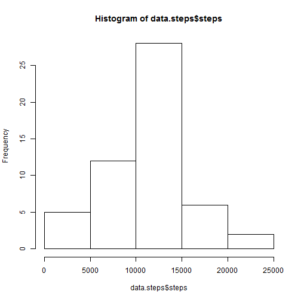
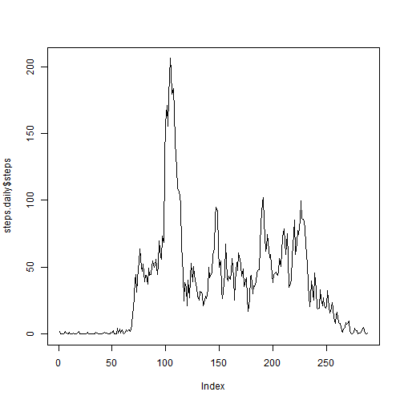
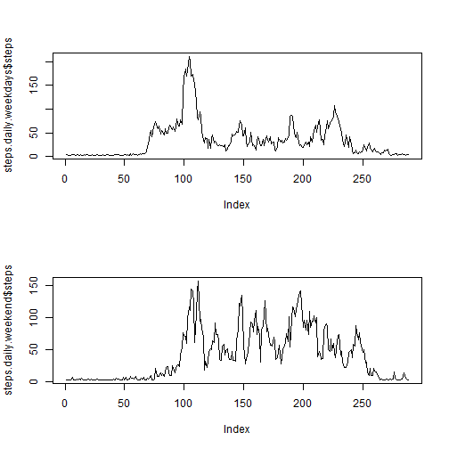

# Reproducible Research: Peer Assessment 1


## Loading and preprocessing the data

```r
data = read.csv("activity.csv", header = TRUE, sep = ",", na.strings = "NA")
# Remove NA
data.noNA <- data[!is.na(data$steps), ]
```


## What is mean total number of steps taken per day?


```r
# Histogram

data.steps <- aggregate(steps ~ date, data = data.noNA, FUN = sum)
hist(data.steps$steps)
```

 

```r

# Obtain mean, median and daily steps without NA


mean_steps <- mean(data.noNA$steps)
median_steps <- median(data.noNA$steps)
```


* The mean is: 37.3826

* The median is: 0


## What is the average daily activity pattern?

```r
steps.daily <- aggregate(steps ~ interval, data = data.noNA, FUN = mean)
plot(steps.daily$steps, type = "l")
```

 


* The median is: 206.1698


## Imputing missing values


```r
meansteps.dataframe <- aggregate(steps ~ date, data = data, FUN = mean)
meansteps <- meansteps.dataframe$steps
names(meansteps) <- meansteps.dataframe$date


dataAll <- data
dataAll[is.na(dataAll$steps), "steps"] <- meansteps[dataAll[is.na(dataAll$steps), 
    "date"]]

mean_steps <- mean(dataAll$steps, na.rm = T)
median_steps <- median(dataAll$steps, na.rm = T)
```


* The mean is: 36.2766

* The median is: 0


## Are there differences in activity patterns between weekdays and weekends?


```r
weekday <- strftime(as.Date(dataAll$date), format = "%u")
is_weekend <- as.numeric(weekday) > 5


steps.daily.weekdays <- aggregate(steps ~ interval, data = dataAll[!is_weekend, 
    ], FUN = mean)
steps.daily.weekend <- aggregate(steps ~ interval, data = dataAll[is_weekend, 
    ], FUN = mean)


par(mfrow = c(2, 1))
plot(steps.daily.weekdays$steps, type = "l")
plot(steps.daily.weekend$steps, type = "l")
```

 


